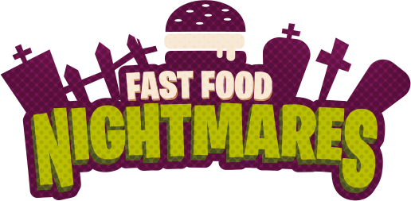

# Fast Food Nightmares

ENTER THE NIGHTMARE

Play as a burger that has come to life in this wacky horror diner, where all the rotten food terrorizes the place! 

Survive wave after wave of fierceless monsters and bosses with guns, granades, swords and more!

Will you be fast enough to escape the nightmare? Or just become food for the monsters?

Venture into Joe's Diner, where a chef about to go into bankrupcy discovers a way to bring a hamburguer to life!
But this comes at a great cost, all the rotten food also comes to life and decides to plot against the chef, kidnapping him and 
taking him far away from the diner! 

Now it's up to you to go and rescue your creator, using all the weapons at your disposal. 

Shoot 'em.
Slice 'em,
Blast 'em!

We want Fast Food Nightmares to be a game where the goal is to survive the waves of terrible food monsters and extreme bosses that are headed towards you,

Gather souls to upgrade your weapons and their drop rate for future runs.

Unlock skins, gadgets, power ups and more!

 

This is a game (still in development) developed by students from <a href="https://www.imagecampus.edu.ar/">Image Campus</a>

   

## Credits

- **Ivan Ignacio Castellano** - *Programmer ,UI | UX Designer & Project Manager* - </a>
- **Lucas Burghini** - *Lead 3D Artist* - 
- **Danny Tapia** - *2D&3D Artist* -   
- **Yann Finidori** - *Music & SFX* 
- **Leonardo Calvo** - *Music & SFX*
- **Mariano Mallea** - *Animator & Rig* -  
- **Calbucura Emiliano** - *Q&A*
- **Pereyra Tomás** - *Q&A*

This game was also possible thanks to the support of these professors:

- **Sergio Baretto**
- **Federico Barra**
- **Jorge Cuéllar**
- **Fernando Puig**
- **Eugenio Taboada**

## Acknowledgements

**INFINITE THANKS**
To all the people who played our game in Nucleo Event!
Thanks to you we get to where we are, you are also part of Fast Food Nightmares! :)

## Links

Download it from itch.io: https://nightmaresstudios.itch.io/fast-food-nightmares
